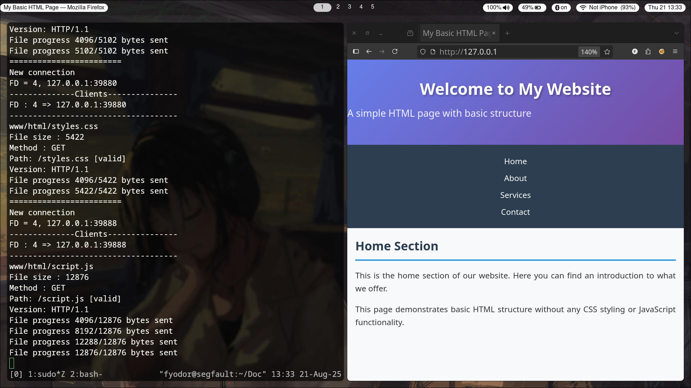

# Lightweight HTTP Server

## A lightweight web server that can host web pages and handle multiple clients concurrently



This project is a basic web server written in C programming language that serves static files under specified directory. It supports handling multiple client request using non-blocking sockets and `poll()` and provide basic HTTP responses such as `200 OK`, `404 Not Found`, and `405 Method Not Allowed`. This is an example of how `poll()` works with Non-blocking I/O and it is useful for those who want to understand how a web server works at the socket and protocol level, how it can handle multiple clients and how the HTTP protocol works.

## How it works

- Instead of forking a new process for each incoming connection (which is traditional but expensive), an event loop with `poll()` is used to monitor any event on each opened file descriptor (socket). Depending on client state, sockets are polled for `POLLIN`(read) or `POLLOUT`(write) in order to handle multiple clients concurrently.
- The server and client sockets are set to `O_NONBLOCK` using `fcntl()`
- The server can also track and display the file descriptor for each connection as PoC. 
- The program tracks file and buffer offset and the state of each client (`READING_REQ`, `SENDING_HEADER`, `SENDING_FILE`, `CONN_DONE`)
- Files are read in small chunks and written to the client with `send_file_chunk()`. This prevents blocking on large files.

Track the state for each client.

## Configuration
Place your files under `www/html`
```
├── Makefile
├── README.md
├── config
│   ├── 404.html
│   ├── 405.html
│   ├── mime.types
│   └── www
│       └── html
│           ├── bak
│           ├── index.html
│           ├── index.html.bak
│           ├── script.js
│           └── styles.css
```

Error pages
```
config/404.html
config/405.html
```

## Installation and Usage

Clone this repository
```
git clone https://github.com/thihahtoozin/lightweight-http-server.git
```

`cd` in project directory
```
cd lightweight-http-server
```

Compile the code using `gcc`
```
make build/server
```

Run the server
```
./build/server <ip> <port>
```
Example
```
./build/server 127.0.0.1 8080
```

## Known Issues
This project is still ongoing. It still needs to
1. support `POST` Method
2. support PHP and other backend implementations
3. load MIME types through a config file
4. implement logging mechanism
5. support `TLS/HTTPS` with OpenSSL
